# 🍁 Dominion — Decision Tree & Game Flow

> **Generated file — do not edit by hand.** Run `node tools/build-docs.mjs` after
> changing `index.html`. Every number below is read out of the live `DECISIONS`
> array, so this document cannot drift from the game.

---

## Game Flow

The game is linear: 25 decision points in chronological order (1968 → 2025), of which 4 are elections. Each decision offers 2–3 choices; the choice order is shuffled per run, so screen position carries no information.

```
START
  │
  ├─ [1968] 📜 The Just Society                        ► 3 choices
  │
  ├─ [1970] 📜 The October Crisis                      ► 3 choices
  │
  ├─ [1971] 📜 A Multicultural Country                 ► 3 choices
  │
  ├─ [1972] 🗳️ Election of 1972                        ► 2 choices
  │
  ├─ [1976] 📜 The Montreal Olympics                   ► 2 choices
  │
  ├─ [1977] 📜 The Berger Inquiry                      ► 3 choices
  │
  ├─ [1980] 📜 The National Energy Program             ► 3 choices
  │
  ├─ [1980] 🗳️ The Quebec Referendum                   ► 3 choices
  │
  ├─ [1982] 📜 Bringing the Constitution Home          ► 3 choices
  │
  ├─ [1984] 🗳️ Election of 1984                        ► 3 choices
  │
  ├─ [1988] 📜 Free Trade with America                 ► 3 choices
  │
  ├─ [1991] 📜 The GST                                 ► 3 choices
  │
  ├─ [1992] 📜 The Charlottetown Accord                ► 3 choices
  │
  ├─ [1992] 📜 The Cod Moratorium                      ► 3 choices
  │
  ├─ [1995] 📜 The Deficit                             ► 3 choices
  │
  ├─ [1995] 📜 The Quebec Referendum, Round Two        ► 4 choices
  │
  ├─ [2002] 📜 Kyoto or Not                            ► 3 choices
  │
  ├─ [2005] 📜 Same-Sex Marriage                       ► 3 choices
  │
  ├─ [2008] 📜 The Global Financial Crisis             ► 3 choices
  │
  ├─ [2012] 📜 The Oil Sands                           ► 3 choices
  │
  ├─ [2015] 🗳️ Election of 2015                        ► 3 choices
  │
  ├─ [2018] 📜 Cannabis Legalization                   ► 3 choices
  │
  ├─ [2019] 📜 The Carbon Tax                          ► 3 choices
  │
  ├─ [2020] 📜 The Pandemic                            ► 3 choices
  │
  ├─ [2025] 📜 The Trump Tariffs                       ► 3 choices
  │
  ▼
END — "Your Canada, 2030"
```

---

## Metrics

All metrics start at **50** and are clamped to **0–100**. The first six determine the
final score; **Approval** gates elections but is excluded from scoring.

| Metric | Reachable range | Decisions that move it | Controllable swing |
|---|---|---|---|
| **National Unity** | 0–100 | 24/25 | 261 |
| **Economy** | 0–100 | 19/25 | 172 |
| **Rights & Liberties** | 0–100 | 17/25 | 146 |
| **Environment** | 0–100 | 7/25 | 113 |
| **External Independence** | 8–100 | 9/25 | 97 |
| **Self-Determination** | 32–100 | 14/25 | 70 |
| **Social Wellbeing** | 0–100 | 24/25 | 201 |
| **Approval** | 0–100 | 24/25 | 235 |

---

## Elections

| Year | Title | Approval needed | Approval reachable at that point | Gate binds? |
|---|---|---|---|---|
| 1972 | Election of 1972 | 41% | 34–73 | yes |
| 1980 | The Quebec Referendum | 28% | 26–84 | yes |
| 1984 | Election of 1984 | 49% | 15–92 | yes |
| 2015 | Election of 2015 | 30% | 0–100 | yes |

**Resolution** (single implementation, shared by the UI and the analyzer):

```js
function resolveElection(decision, choice, approvalAtBallot) {
  const needed = decision.approvalNeeded ?? 30;
  if (choice.result === 'lose') return 'lose';
  if (approvalAtBallot < needed) return 'lose';
  return choice.result === 'minority' ? 'minority' : 'win';
}
```

**Defeat has teeth.** Losing puts you in opposition for the next 2 decisions: you are still asked, but your choice lands at 0% strength.

---

## Scoring

```
finalScore = weighted mean of unity, economy, rights, enviro, externalIndependence (0.5), selfDetermination (0.5), social
```

The real timeline — the choices Canada actually made — scores **73.7** under these
same rules. That, not 50, is the bar for "you beat history".

| Metric | Real history, 2030 |
|---|---|
| National Unity | 69 |
| Economy | 45 |
| Rights & Liberties | 87 |
| Environment | 83 |
| External Independence | 84 |
| Self-Determination | 74 |
| Social Wellbeing | 79 |
| Approval | 100 |

---

## Decision-by-decision

### 📜 1968 — The Just Society

> You've just been elected Prime Minister. Quebec is restless — the Quiet Revolution has transformed the province, and the separatist movement is gaining steam. The Royal Commission on Bilingualism and Biculturalism has reported that Canada is in crisis. You promised a *'just society'* in your campaign. What do you do first?

**Term 1**

| # | Choice | National Unity | Economy | Rights & Liberties | Environment | External Independence | Self-Determination | Social Wellbeing | Approval | Net | Historical |
|---|---|---|---|---|---|---|---|---|---|---|---|
| 1 | Pass the Official Languages Act | +12 | — | +5 | — | — | +5 | -2 | +3 | +20 | **✓ actual** |
| 2 | Delay — focus on the economy instead | -8 | +3 | — | — | — | — | -3 | +2 | -8 |  |
| 3 | Go further — dual federalism | +6 | — | +2 | — | — | +3 | +2 | -5 | +13 |  |

### 📜 1970 — The October Crisis

> October 1970. The FLQ has kidnapped British diplomat James Cross and Quebec Labour Minister Pierre Laporte. Bombs have been going off in Montreal for months. The Premier of Quebec, Robert Bourassa, asks you to invoke the *War Measures Act* — peacetime martial law, never used before. 500 people could be arrested overnight. A reporter asks how far you'll go. *'Just watch me,'* you say.

**Term 1**

| # | Choice | National Unity | Economy | Rights & Liberties | Environment | External Independence | Self-Determination | Social Wellbeing | Approval | Net | Historical |
|---|---|---|---|---|---|---|---|---|---|---|---|
| 1 | Invoke the War Measures Act | +2 | — | -10 | — | — | -3 | -5 | +15 | -16 | **✓ actual** |
| 2 | Use police and negotiation only | -5 | — | +8 | — | — | +3 | +3 | -8 | +9 |  |
| 3 | Invoke the Act but with a sunset clause | -1 | — | -4 | — | — | -1 | -2 | +5 | -8 |  |

### 📜 1971 — A Multicultural Country

> The Royal Commission on Biculturalism revealed a third reality: Canada isn't just English and French. It's Ukrainian, Italian, Chinese, Indigenous, dozens of peoples. You're about to announce a new policy — the first official multiculturalism policy in the world. Some say it dilutes the French-English compact. Others say it's the only honest description of what Canada already is.

**Term 1**

| # | Choice | National Unity | Economy | Rights & Liberties | Environment | External Independence | Self-Determination | Social Wellbeing | Approval | Net | Historical |
|---|---|---|---|---|---|---|---|---|---|---|---|
| 1 | Adopt official multiculturalism | +6 | +2 | +5 | — | — | — | +8 | +5 | +21 | **✓ actual** |
| 2 | Bilingualism is enough — reject multiculturalism | +5 | +5 | -3 | — | — | -2 | -5 | -3 | — |  |
| 3 | Adopt it but with integration requirements | +6 | +3 | +2 | — | — | — | +5 | +3 | +16 |  |

### 🗳️ 1972 — Election of 1972

> Your first election as Prime Minister. The opposition says you're arrogant, too intellectual, out of touch. The economy is softening. But your language policy and the October Crisis response are still fresh. Do you campaign on your record, or pivot?

**Approval needed:** 41%

| # | Choice | National Unity | Economy | Rights & Liberties | Environment | External Independence | Self-Determination | Social Wellbeing | Approval | Net | Result | Historical |
|---|---|---|---|---|---|---|---|---|---|---|---|---|
| 1 | Campaign on the record — 'A Just Society' | +3 | — | — | — | — | — | +2 | +3 | +5 | minority | **✓ actual** |
| 2 | Pivot to economic competence | — | +5 | — | — | — | — | — | +2 | +5 | minority |  |

### 📜 1976 — The Montreal Olympics

> Montreal is hosting the 1976 Olympics. The facilities are spectacular — but the costs are spiraling. Mayor Jean Drapeau promised the Games would pay for themselves. They won't. The final bill will be billions. Do you bail out the Games?

**Term 2**

| # | Choice | National Unity | Economy | Rights & Liberties | Environment | External Independence | Self-Determination | Social Wellbeing | Approval | Net | Historical |
|---|---|---|---|---|---|---|---|---|---|---|---|
| 1 | Yes — Canada must not be embarrassed | +5 | -8 | — | — | — | -2 | +3 | +5 | -2 |  |
| 2 | No — let Montreal handle its own mess | -8 | +3 | — | — | — | +2 | — | -5 | -3 | **✓ actual** |

### 📜 1977 — The Berger Inquiry

> A pipeline company wants to build across the Mackenzie Valley — through Dene and Inuit land, unceded and untouched. Justice Thomas Berger has held hearings across the North — the first time Indigenous voices were heard on a resource project. His report recommends a 10-year moratorium. The pipeline would open the Arctic to industry. *The world is watching: what does Canada value more — energy or land?*

**Term 2**

| # | Choice | National Unity | Economy | Rights & Liberties | Environment | External Independence | Self-Determination | Social Wellbeing | Approval | Net | Historical |
|---|---|---|---|---|---|---|---|---|---|---|---|
| 1 | Accept the moratorium — listen to the land | +3 | -5 | +8 | +12 | — | +3 | +5 | — | +26 | **✓ actual** |
| 2 | Build the pipeline — the North needs development | -3 | +8 | -5 | -12 | +5 | -3 | +2 | — | -8 |  |
| 3 | Build it with Indigenous co-ownership | +4 | +5 | +5 | -4 | +2 | +3 | +6 | — | +21 |  |

### 📜 1980 — The National Energy Program

> Oil prices have quadrupled. Alberta is swimming in revenue while the rest of Canada pays through the nose. You propose the National Energy Program (NEP) — a made-in-Canada oil policy that would control prices, promote Canadian ownership, and keep energy affordable for Eastern Canada. Alberta's Premier Peter Lougheed calls it *'a declaration of economic war.'*

**Term 3**

| # | Choice | National Unity | Economy | Rights & Liberties | Environment | External Independence | Self-Determination | Social Wellbeing | Approval | Net | Historical |
|---|---|---|---|---|---|---|---|---|---|---|---|
| 1 | Implement the NEP fully | -12 | -5 | — | — | +8 | -3 | +5 | -3 | -7 | **✓ actual** |
| 2 | Negotiate a revenue-sharing deal with provinces | +2 | +3 | — | — | +2 | +3 | +2 | +3 | +12 |  |
| 3 | Let the market sort it out | -5 | +5 | — | — | -8 | — | -5 | -5 | -13 |  |

### 🗳️ 1980 — The Quebec Referendum

> May 1980. Quebec Premier René Lévesque has called a referendum on sovereignty-association. The question: should Quebec negotiate a new relationship with the rest of Canada? You're a federalist from Montreal. How hard do you campaign?

**Approval needed:** 28%

| # | Choice | National Unity | Economy | Rights & Liberties | Environment | External Independence | Self-Determination | Social Wellbeing | Approval | Net | Result | Historical |
|---|---|---|---|---|---|---|---|---|---|---|---|---|
| 1 | Campaign hard — 'My country is my country' | +8 | — | — | — | — | +3 | — | +5 | +11 | win | **✓ actual** |
| 2 | Let Quebecers decide for themselves | -8 | — | +5 | — | — | +4 | +2 | -3 | +3 | lose |  |
| 3 | YES — endorse sovereignty-association | -18 | — | +2 | — | — | +8 | — | -6 | -8 | lose |  |

### 📜 1982 — Bringing the Constitution Home

> The British North America Act — Canada's constitution — is still a British law. You want to patriate it: bring it home, with a Canadian amending formula and a *Charter of Rights and Freedoms*. Eight premiers oppose you. Quebec has never signed the 1982 Constitution. This is the biggest constitutional moment since 1867.

**Term 3**

| # | Choice | National Unity | Economy | Rights & Liberties | Environment | External Independence | Self-Determination | Social Wellbeing | Approval | Net | Historical |
|---|---|---|---|---|---|---|---|---|---|---|---|
| 1 | Patriate with the Charter — with or without Quebec | -8 | — | +12 | — | +10 | -3 | +3 | +3 | +14 | **✓ actual** |
| 2 | Negotiate until Quebec agrees | +5 | — | +3 | — | +2 | +5 | — | -5 | +15 |  |
| 3 | Patriate without the Charter | +2 | — | -8 | — | +10 | -2 | — | +2 | +2 |  |

### 🗳️ 1984 — Election of 1984

> You've been PM for 16 years. The economy has struggled. The NEP angered the West. Quebec is still out of the constitution. But you patriated the Constitution and gave Canadians the Charter. The voters are tired of you. *It's time.*

**Approval needed:** 49%

| # | Choice | National Unity | Economy | Rights & Liberties | Environment | External Independence | Self-Determination | Social Wellbeing | Approval | Net | Result | Historical |
|---|---|---|---|---|---|---|---|---|---|---|---|---|
| 1 | Campaign on the Charter and sovereignty | — | — | +2 | — | — | — | — | +5 | +2 | win |  |
| 2 | Campaign on experience and stability | — | +2 | — | — | — | — | — | +8 | +2 | minority |  |
| 3 | Step aside — let a new leader carry the banner | +2 | — | — | — | — | — | — | +3 | +2 | lose | **✓ actual** |

### 📜 1988 — Free Trade with America

> The new Progressive Conservative government has negotiated a Free Trade Agreement with the United States. It's the defining issue of the era. Free traders say it will transform the economy. Critics say it's the *beginning of the end of Canadian sovereignty* — a slow absorption into the American orbit. The election is a referendum on free trade.

**Term 4**

| # | Choice | National Unity | Economy | Rights & Liberties | Environment | External Independence | Self-Determination | Social Wellbeing | Approval | Net | Historical |
|---|---|---|---|---|---|---|---|---|---|---|---|
| 1 | Support free trade — the deal is done | -3 | +10 | — | — | -10 | — | -2 | +3 | -5 | **✓ actual** |
| 2 | Oppose — renegotiate for cultural exemptions | +2 | +4 | — | — | +3 | — | +3 | -2 | +12 |  |
| 3 | Kill the deal — build east-west trade instead | +5 | -10 | — | — | +8 | — | +3 | -5 | +6 |  |

### 📜 1991 — The GST

> The government needs revenue. The deficit is enormous. The proposal: a 7% Goods and Services Tax on almost everything. It's deeply unpopular — every Canadian will see it on every receipt. But it will fund the social state for a generation.

**Term 5**

| # | Choice | National Unity | Economy | Rights & Liberties | Environment | External Independence | Self-Determination | Social Wellbeing | Approval | Net | Historical |
|---|---|---|---|---|---|---|---|---|---|---|---|
| 1 | Implement the GST | -3 | +5 | — | — | — | — | +3 | -12 | +5 | **✓ actual** |
| 2 | Replace with a hidden manufacturer's tax | +1 | +3 | — | — | — | — | +1 | +2 | +5 |  |
| 3 | Cut spending instead — no new tax | -5 | +6 | -2 | — | — | — | -10 | +3 | -11 |  |

### 📜 1992 — The Charlottetown Accord

> October 1992. Meech Lake died two years ago. A broader constitutional package is now before Canadians: Quebec as a distinct society, elected Senate reform, Indigenous self-government, and a social union — all in one referendum. It is the only time Canadians will vote directly on a constitutional settlement. The coalition behind it is broad; the coalition against it is broader.

**Term 5**

| # | Choice | National Unity | Economy | Rights & Liberties | Environment | External Independence | Self-Determination | Social Wellbeing | Approval | Net | Historical |
|---|---|---|---|---|---|---|---|---|---|---|---|
| 1 | Campaign for a Yes — the deal is worth it | +10 | — | -3 | — | — | +2 | -2 | -3 | +7 |  |
| 2 | Respect the No vote — return to ordinary politics | -6 | — | +3 | — | — | +3 | +1 | +1 | +1 | **✓ actual** |
| 3 | Return with a narrower settlement | +5 | — | +4 | — | — | +1 | +2 | -3 | +12 |  |

### 📜 1992 — The Cod Moratorium

> July 1992. The cod stocks off Newfoundland and Labrador have collapsed — 500 years of fishing, gone. 40,000 people are about to lose their livelihood overnight. The science is clear: the fishery must close to save the stock. But the culture, the communities, the identity of Atlantic Canada is built on cod. *This is not a policy decision — it's a funeral.*

**Term 5**

| # | Choice | National Unity | Economy | Rights & Liberties | Environment | External Independence | Self-Determination | Social Wellbeing | Approval | Net | Historical |
|---|---|---|---|---|---|---|---|---|---|---|---|
| 1 | Close the fishery — the cod must recover | -3 | -8 | — | +12 | +2 | — | -8 | -3 | -5 | **✓ actual** |
| 2 | Keep the fishery open — let the communities survive | +2 | +3 | — | -10 | -2 | — | +5 | +5 | -2 |  |
| 3 | Close it — but buy the licences and invest in transition | +4 | -3 | — | +10 | +3 | — | +3 | +2 | +17 |  |

### 📜 1995 — The Deficit

> February 1995. Canada's debt is approaching 70% of GDP. The bond rating agencies are making noise. Your Finance Minister proposes slashing the deficit — by cutting the Canada Health and Social Transfer (CHST), $7 billion out of provincial transfers for health and education. It will balance the budget. It will also gut the social contract that holds Canada together. *The budget is in two weeks.*

**Term 6**

| # | Choice | National Unity | Economy | Rights & Liberties | Environment | External Independence | Self-Determination | Social Wellbeing | Approval | Net | Historical |
|---|---|---|---|---|---|---|---|---|---|---|---|
| 1 | Cut transfers — balance the budget | -5 | +10 | -5 | — | — | — | -12 | -3 | -12 | **✓ actual** |
| 2 | Balanced approach — tax increases + moderate cuts | +1 | +5 | -2 | — | — | — | -4 | -5 | — |  |
| 3 | Invest in growth — let the deficit ride | +3 | -5 | +2 | — | — | — | +5 | +5 | +5 |  |

### 📜 1995 — The Quebec Referendum, Round Two

> October 30, 1995. The Parti Québécois has called a second referendum. The question is vague — sovereignty with an offer of partnership. The polls are dead even. You're watching the results come in from Ottawa. *This is the night Canada almost breaks apart.*

**Term 7**

| # | Choice | National Unity | Economy | Rights & Liberties | Environment | External Independence | Self-Determination | Social Wellbeing | Approval | Net | Historical |
|---|---|---|---|---|---|---|---|---|---|---|---|
| 1 | Fight with everything — a passionate Canada | +10 | — | — | — | — | +5 | +2 | +5 | +17 | **✓ actual** |
| 2 | Let Quebec decide — minimal federal involvement | -20 | — | +8 | — | — | +6 | -5 | -3 | -11 |  |
| 3 | YES — quietly hope for Oui | -22 | — | +6 | — | — | +7 | — | -8 | -9 |  |
| 4 | Offer clear constitutional reform — the clarity path | +5 | — | +3 | — | — | +3 | — | +3 | +11 |  |

### 📜 2002 — Kyoto or Not

> Climate change is becoming a mainstream issue. The Kyoto Protocol asks developed countries to reduce greenhouse gas emissions to 6% below 1990 levels by 2012. Canada's economy is resource-heavy — Alberta's oil sands are just beginning their boom. Ratifying Kyoto means constraining that growth.

**Term 8**

| # | Choice | National Unity | Economy | Rights & Liberties | Environment | External Independence | Self-Determination | Social Wellbeing | Approval | Net | Historical |
|---|---|---|---|---|---|---|---|---|---|---|---|
| 1 | Ratify Kyoto — lead on climate | — | -5 | — | +12 | +3 | — | +2 | -2 | +12 | **✓ actual** |
| 2 | Ratify with concessions for the energy sector | — | +2 | — | +4 | +1 | — | — | +2 | +7 |  |
| 3 | Don't ratify — the economy needs oil | — | +6 | — | -10 | -2 | — | -2 | +3 | -8 |  |

### 📜 2005 — Same-Sex Marriage

> Courts in Ontario, BC, and Quebec have already legalized same-sex marriage. The Supreme Court has said Parliament has the power to extend it nationwide. The Civil Marriage Act would make Canada the fourth country in the world to legalize same-sex marriage. It's a free vote in Parliament. Your minority government is fragile.

**Term 9**

| # | Choice | National Unity | Economy | Rights & Liberties | Environment | External Independence | Self-Determination | Social Wellbeing | Approval | Net | Historical |
|---|---|---|---|---|---|---|---|---|---|---|---|
| 1 | Pass the Civil Marriage Act | -2 | — | +10 | — | — | +3 | +8 | -3 | +19 | **✓ actual** |
| 2 | Civil unions only — not marriage | +1 | — | +4 | — | — | +1 | +4 | +2 | +10 |  |
| 3 | Defend traditional marriage | +3 | — | -10 | — | — | -3 | -8 | +3 | -18 |  |

### 📜 2008 — The Global Financial Crisis

> September 2008. Lehman Brothers has collapsed. The global financial system is in cardiac arrest. Canada's banks are relatively solid — stricter regulation kept them from the worst subprime excesses — but the real economy is tanking. Auto manufacturing in Ontario is hemorrhaging jobs. Do you stimulate or do you cut?

**Term 10**

| # | Choice | National Unity | Economy | Rights & Liberties | Environment | External Independence | Self-Determination | Social Wellbeing | Approval | Net | Historical |
|---|---|---|---|---|---|---|---|---|---|---|---|
| 1 | Stimulate — the Economic Action Plan | +3 | +5 | — | -2 | +2 | — | +5 | +8 | +13 | **✓ actual** |
| 2 | Steady as she goes — modest support | — | +2 | — | — | — | — | — | — | +2 |  |
| 3 | Austerity — balance the budget through the recession | -5 | +3 | -2 | — | +3 | — | -10 | -10 | -11 |  |

### 📜 2012 — The Oil Sands

> The Alberta oil sands are the third-largest oil reserve in the world. They're also Canada's largest source of emissions. Northern Alberta is a boom economy — Fort McMurray is growing faster than any city in Canada. But the environmental cost is visible from space: tailings ponds, deforestation, carbon. The proposed pipelines to the coast would lock in decades of oil extraction. *What is Canada's future economy?*

**Term 11**

| # | Choice | National Unity | Economy | Rights & Liberties | Environment | External Independence | Self-Determination | Social Wellbeing | Approval | Net | Historical |
|---|---|---|---|---|---|---|---|---|---|---|---|
| 1 | Regulate and cap — transition starts now | -5 | -5 | — | +10 | +3 | — | +2 | -5 | +5 |  |
| 2 | Approve pipelines — let the boom continue | +3 | +10 | — | -12 | -2 | — | -3 | +3 | -4 | **✓ actual** |
| 3 | Clean growth strategy — diversify while extracting | +5 | +5 | — | +2 | +2 | — | +3 | +5 | +17 |  |

### 🗳️ 2015 — Election of 2015

> It's been a decade of Conservative government. The country is divided — Alberta vs. the rest, resource economy vs. environment, the old Canada vs. the new. The opposition campaign is *'Real Change'* — a young, photogenic leader promising a new era. You need to decide what kind of Canada you're offering.

**Approval needed:** 30%

| # | Choice | National Unity | Economy | Rights & Liberties | Environment | External Independence | Self-Determination | Social Wellbeing | Approval | Net | Result | Historical |
|---|---|---|---|---|---|---|---|---|---|---|---|---|
| 1 | Promise a progressive era — climate, reconciliation, diversity | +2 | — | +5 | +3 | — | — | +5 | +5 | +15 | win | **✓ actual** |
| 2 | Steady management — incremental change | +1 | +3 | — | — | — | — | — | — | +4 | minority |  |
| 3 | Pivot right — resource economy and security | -3 | +5 | -5 | -5 | — | — | -5 | -3 | -13 | lose |  |

### 📜 2018 — Cannabis Legalization

> You promised to legalize recreational cannabis. The first major country to do so. The arguments: end the black market, keep money away from organized crime, regulate quality, stop criminalizing young people. The opposition: it normalizes drug use, endangers youth, displeases the international community. *Canada would be the second country in the world, after Uruguay.*

**Term 12**

| # | Choice | National Unity | Economy | Rights & Liberties | Environment | External Independence | Self-Determination | Social Wellbeing | Approval | Net | Historical |
|---|---|---|---|---|---|---|---|---|---|---|---|
| 1 | Legalize — regulate and tax | +1 | +3 | +5 | — | — | +3 | +5 | -2 | +17 | **✓ actual** |
| 2 | Decriminalize only — no retail market | +2 | — | +6 | — | — | +4 | +3 | +2 | +15 |  |
| 3 | Keep it criminal — not now | +3 | -3 | +2 | — | — | -2 | -3 | +3 | -3 |  |

### 📜 2019 — The Carbon Tax

> You've implemented a national carbon price — $20 per tonne in 2019, rising to $50 by 2022, and $170 by 2030. It's the most controversial climate policy in Canadian history. Alberta calls it *'the second NEP.'* The Conservatives make it their central attack. But economists say it's the most efficient way to cut emissions. The revenue goes back to Canadians as a dividend check. *Six years from now, a new government will scrap the consumer fuel charge entirely — but right now, in 2019, you're setting the course.*

**Term 13**

| # | Choice | National Unity | Economy | Rights & Liberties | Environment | External Independence | Self-Determination | Social Wellbeing | Approval | Net | Historical |
|---|---|---|---|---|---|---|---|---|---|---|---|
| 1 | Hold firm — the price rises as planned | -5 | -3 | — | +8 | — | +3 | +2 | -5 | +5 | **✓ actual** |
| 2 | Pause the increases — freeze at $50 | +2 | +2 | — | +3 | — | — | — | +3 | +7 |  |
| 3 | Scrap the carbon tax — use regulations instead | +5 | +5 | — | -5 | — | -2 | -2 | +5 | +1 |  |

### 📜 2020 — The Pandemic

> March 2020. COVID-19 arrives in Canada. Borders close, businesses shutter, the economy freezes. You're looking at potential unemployment not seen since the 1930s. The choice: how big is the response? How much debt? How much control?

**Term 14**

| # | Choice | National Unity | Economy | Rights & Liberties | Environment | External Independence | Self-Determination | Social Wellbeing | Approval | Net | Historical |
|---|---|---|---|---|---|---|---|---|---|---|---|
| 1 | Go big — CERB and massive support | +5 | -5 | -3 | — | — | +3 | +10 | +10 | +10 | **✓ actual** |
| 2 | Moderate — targeted support only | +2 | -2 | +2 | — | — | +1 | +3 | +3 | +6 |  |
| 3 | Minimal — let people make their own choices | -8 | +3 | +5 | — | — | -2 | -15 | -5 | -17 |  |

### 📜 2025 — The Trump Tariffs

> January 2025. The new US president has imposed 25% tariffs on Canadian goods and is openly threatening annexation — calling Canada *the 51st state* and the Prime Minister *'Governor.'* The trade war is here. This is the most serious threat to Canadian sovereignty since 1812. How do you respond?

**Term 15**

| # | Choice | National Unity | Economy | Rights & Liberties | Environment | External Independence | Self-Determination | Social Wellbeing | Approval | Net | Historical |
|---|---|---|---|---|---|---|---|---|---|---|---|
| 1 | Retaliate and diversify — 'Canada Strong' | +10 | -5 | +2 | — | +12 | — | -2 | +10 | +17 | **✓ actual** |
| 2 | Negotiate — find a deal, avoid escalation | -5 | +5 | -2 | — | -8 | — | — | -5 | -10 |  |
| 3 | Full economic integration — embrace the future | -15 | +15 | -5 | — | -20 | — | +2 | -8 | -23 |  |

---

## Full decision map

```mermaid
graph TD
    Start((START))
    Start --> D0["📜 1968: The Just Society"]
    D0 -->|"Pass the Official Languages Act"| D0c0["unity+12, rights+5, selfDetermination+5, social-2, approval+3"]
    D0c0 --> D1
    D0 -->|"Delay - focus on the economy instead"| D0c1["unity-8, economy+3, social-3, approval+2"]
    D0c1 --> D1
    D0 -->|"Go further - dual federalism"| D0c2["unity+6, rights+2, selfDetermination+3, social+2, approval-5"]
    D0c2 --> D1
    D1["📜 1970: The October Crisis"]
    D1 -->|"Invoke the War Measures Act"| D1c0["unity+2, rights-10, selfDetermination-3, social-5, approval+15"]
    D1c0 --> D2
    D1 -->|"Use police and negotiation only"| D1c1["unity-5, rights+8, selfDetermination+3, social+3, approval-8"]
    D1c1 --> D2
    D1 -->|"Invoke the Act but with a sunset clause"| D1c2["unity-1, rights-4, selfDetermination-1, social-2, approval+5"]
    D1c2 --> D2
    D2["📜 1971: A Multicultural Country"]
    D2 -->|"Adopt official multiculturalism"| D2c0["unity+6, economy+2, rights+5, social+8, approval+5"]
    D2c0 --> D3
    D2 -->|"Bilingualism is enough - reject multiculturalism"| D2c1["unity+5, economy+5, rights-3, selfDetermination-2, social-5, approval-3"]
    D2c1 --> D3
    D2 -->|"Adopt it but with integration requirements"| D2c2["unity+6, economy+3, rights+2, social+5, approval+3"]
    D2c2 --> D3
    D3["🗳️ 1972: Election of 1972"]
    D3 -->|"Campaign on the record - 'A Just Society'"| D3c0["unity+3, social+2, approval+3"]
    D3c0 --> D4
    D3 -->|"Pivot to economic competence"| D3c1["economy+5, approval+2"]
    D3c1 --> D4
    D4["📜 1976: The Montreal Olympics"]
    D4 -->|"Yes - Canada must not be embarrassed"| D4c0["unity+5, economy-8, selfDetermination-2, social+3, approval+5"]
    D4c0 --> D5
    D4 -->|"No - let Montreal handle its own mess"| D4c1["unity-8, economy+3, selfDetermination+2, approval-5"]
    D4c1 --> D5
    D5["📜 1977: The Berger Inquiry"]
    D5 -->|"Accept the moratorium - listen to the land"| D5c0["unity+3, economy-5, rights+8, enviro+12, selfDetermination+3, social+5"]
    D5c0 --> D6
    D5 -->|"Build the pipeline - the North needs development"| D5c1["unity-3, economy+8, rights-5, enviro-12, externalIndependence+5, selfDetermination-3, social+2"]
    D5c1 --> D6
    D5 -->|"Build it with Indigenous co-ownership"| D5c2["unity+4, economy+5, rights+5, enviro-4, externalIndependence+2, selfDetermination+3, social+6"]
    D5c2 --> D6
    D6["📜 1980: The National Energy Program"]
    D6 -->|"Implement the NEP fully"| D6c0["unity-12, economy-5, externalIndependence+8, selfDetermination-3, social+5, approval-3"]
    D6c0 --> D7
    D6 -->|"Negotiate a revenue-sharing deal with provinces"| D6c1["unity+2, economy+3, externalIndependence+2, selfDetermination+3, social+2, approval+3"]
    D6c1 --> D7
    D6 -->|"Let the market sort it out"| D6c2["unity-5, economy+5, externalIndependence-8, social-5, approval-5"]
    D6c2 --> D7
    D7["🗳️ 1980: The Quebec Referendum"]
    D7 -->|"Campaign hard - 'My country is my country'"| D7c0["unity+8, selfDetermination+3, approval+5"]
    D7c0 --> D8
    D7 -->|"Let Quebecers decide for themselves"| D7c1["unity-8, rights+5, selfDetermination+4, social+2, approval-3"]
    D7c1 --> D8
    D7 -->|"YES - endorse sovereignty-association"| D7c2["unity-18, rights+2, selfDetermination+8, approval-6"]
    D7c2 --> D8
    D8["📜 1982: Bringing the Constitution Home"]
    D8 -->|"Patriate with the Charter - with or without Quebec"| D8c0["unity-8, rights+12, externalIndependence+10, selfDetermination-3, social+3, approval+3"]
    D8c0 --> D9
    D8 -->|"Negotiate until Quebec agrees"| D8c1["unity+5, rights+3, externalIndependence+2, selfDetermination+5, approval-5"]
    D8c1 --> D9
    D8 -->|"Patriate without the Charter"| D8c2["unity+2, rights-8, externalIndependence+10, selfDetermination-2, approval+2"]
    D8c2 --> D9
    D9["🗳️ 1984: Election of 1984"]
    D9 -->|"Campaign on the Charter and sovereignty"| D9c0["rights+2, approval+5"]
    D9c0 --> D10
    D9 -->|"Campaign on experience and stability"| D9c1["economy+2, approval+8"]
    D9c1 --> D10
    D9 -->|"Step aside - let a new leader carry the banner"| D9c2["unity+2, approval+3"]
    D9c2 --> D10
    D10["📜 1988: Free Trade with America"]
    D10 -->|"Support free trade - the deal is done"| D10c0["unity-3, economy+10, externalIndependence-10, social-2, approval+3"]
    D10c0 --> D11
    D10 -->|"Oppose - renegotiate for cultural exemptions"| D10c1["unity+2, economy+4, externalIndependence+3, social+3, approval-2"]
    D10c1 --> D11
    D10 -->|"Kill the deal - build east-west trade instead"| D10c2["unity+5, economy-10, externalIndependence+8, social+3, approval-5"]
    D10c2 --> D11
    D11["📜 1991: The GST"]
    D11 -->|"Implement the GST"| D11c0["unity-3, economy+5, social+3, approval-12"]
    D11c0 --> D12
    D11 -->|"Replace with a hidden manufacturer's tax"| D11c1["unity+1, economy+3, social+1, approval+2"]
    D11c1 --> D12
    D11 -->|"Cut spending instead - no new tax"| D11c2["unity-5, economy+6, rights-2, social-10, approval+3"]
    D11c2 --> D12
    D12["📜 1992: The Charlottetown Accord"]
    D12 -->|"Campaign for a Yes - the deal is worth it"| D12c0["unity+10, rights-3, selfDetermination+2, social-2, approval-3"]
    D12c0 --> D13
    D12 -->|"Respect the No vote - return to ordinary politics"| D12c1["unity-6, rights+3, selfDetermination+3, social+1, approval+1"]
    D12c1 --> D13
    D12 -->|"Return with a narrower settlement"| D12c2["unity+5, rights+4, selfDetermination+1, social+2, approval-3"]
    D12c2 --> D13
    D13["📜 1992: The Cod Moratorium"]
    D13 -->|"Close the fishery - the cod must recover"| D13c0["unity-3, economy-8, enviro+12, externalIndependence+2, social-8, approval-3"]
    D13c0 --> D14
    D13 -->|"Keep the fishery open - let the communities survive"| D13c1["unity+2, economy+3, enviro-10, externalIndependence-2, social+5, approval+5"]
    D13c1 --> D14
    D13 -->|"Close it - but buy the licences and invest in transition"| D13c2["unity+4, economy-3, enviro+10, externalIndependence+3, social+3, approval+2"]
    D13c2 --> D14
    D14["📜 1995: The Deficit"]
    D14 -->|"Cut transfers - balance the budget"| D14c0["unity-5, economy+10, rights-5, social-12, approval-3"]
    D14c0 --> D15
    D14 -->|"Balanced approach - tax increases + moderate cuts"| D14c1["unity+1, economy+5, rights-2, social-4, approval-5"]
    D14c1 --> D15
    D14 -->|"Invest in growth - let the deficit ride"| D14c2["unity+3, economy-5, rights+2, social+5, approval+5"]
    D14c2 --> D15
    D15["📜 1995: The Quebec Referendum, Round Two"]
    D15 -->|"Fight with everything - a passionate Canada"| D15c0["unity+10, selfDetermination+5, social+2, approval+5"]
    D15c0 --> D16
    D15 -->|"Let Quebec decide - minimal federal involvement"| D15c1["unity-20, rights+8, selfDetermination+6, social-5, approval-3"]
    D15c1 --> D16
    D15 -->|"YES - quietly hope for Oui"| D15c2["unity-22, rights+6, selfDetermination+7, approval-8"]
    D15c2 --> D16
    D15 -->|"Offer clear constitutional reform - the clarity path"| D15c3["unity+5, rights+3, selfDetermination+3, approval+3"]
    D15c3 --> D16
    D16["📜 2002: Kyoto or Not"]
    D16 -->|"Ratify Kyoto - lead on climate"| D16c0["economy-5, enviro+12, externalIndependence+3, social+2, approval-2"]
    D16c0 --> D17
    D16 -->|"Ratify with concessions for the energy sector"| D16c1["economy+2, enviro+4, externalIndependence+1, approval+2"]
    D16c1 --> D17
    D16 -->|"Don't ratify - the economy needs oil"| D16c2["economy+6, enviro-10, externalIndependence-2, social-2, approval+3"]
    D16c2 --> D17
    D17["📜 2005: Same-Sex Marriage"]
    D17 -->|"Pass the Civil Marriage Act"| D17c0["unity-2, rights+10, selfDetermination+3, social+8, approval-3"]
    D17c0 --> D18
    D17 -->|"Civil unions only - not marriage"| D17c1["unity+1, rights+4, selfDetermination+1, social+4, approval+2"]
    D17c1 --> D18
    D17 -->|"Defend traditional marriage"| D17c2["unity+3, rights-10, selfDetermination-3, social-8, approval+3"]
    D17c2 --> D18
    D18["📜 2008: The Global Financial Crisis"]
    D18 -->|"Stimulate - the Economic Action Plan"| D18c0["unity+3, economy+5, enviro-2, externalIndependence+2, social+5, approval+8"]
    D18c0 --> D19
    D18 -->|"Steady as she goes - modest support"| D18c1["economy+2"]
    D18c1 --> D19
    D18 -->|"Austerity - balance the budget through the recession"| D18c2["unity-5, economy+3, rights-2, externalIndependence+3, social-10, approval-10"]
    D18c2 --> D19
    D19["📜 2012: The Oil Sands"]
    D19 -->|"Regulate and cap - transition starts now"| D19c0["unity-5, economy-5, enviro+10, externalIndependence+3, social+2, approval-5"]
    D19c0 --> D20
    D19 -->|"Approve pipelines - let the boom continue"| D19c1["unity+3, economy+10, enviro-12, externalIndependence-2, social-3, approval+3"]
    D19c1 --> D20
    D19 -->|"Clean growth strategy - diversify while extracting"| D19c2["unity+5, economy+5, enviro+2, externalIndependence+2, social+3, approval+5"]
    D19c2 --> D20
    D20["🗳️ 2015: Election of 2015"]
    D20 -->|"Promise a progressive era - climate, reconciliation, diversity"| D20c0["unity+2, rights+5, enviro+3, social+5, approval+5"]
    D20c0 --> D21
    D20 -->|"Steady management - incremental change"| D20c1["unity+1, economy+3"]
    D20c1 --> D21
    D20 -->|"Pivot right - resource economy and security"| D20c2["unity-3, economy+5, rights-5, enviro-5, social-5, approval-3"]
    D20c2 --> D21
    D21["📜 2018: Cannabis Legalization"]
    D21 -->|"Legalize - regulate and tax"| D21c0["unity+1, economy+3, rights+5, selfDetermination+3, social+5, approval-2"]
    D21c0 --> D22
    D21 -->|"Decriminalize only - no retail market"| D21c1["unity+2, rights+6, selfDetermination+4, social+3, approval+2"]
    D21c1 --> D22
    D21 -->|"Keep it criminal - not now"| D21c2["unity+3, economy-3, rights+2, selfDetermination-2, social-3, approval+3"]
    D21c2 --> D22
    D22["📜 2019: The Carbon Tax"]
    D22 -->|"Hold firm - the price rises as planned"| D22c0["unity-5, economy-3, enviro+8, selfDetermination+3, social+2, approval-5"]
    D22c0 --> D23
    D22 -->|"Pause the increases - freeze at $50"| D22c1["unity+2, economy+2, enviro+3, approval+3"]
    D22c1 --> D23
    D22 -->|"Scrap the carbon tax - use regulations instead"| D22c2["unity+5, economy+5, enviro-5, selfDetermination-2, social-2, approval+5"]
    D22c2 --> D23
    D23["📜 2020: The Pandemic"]
    D23 -->|"Go big - CERB and massive support"| D23c0["unity+5, economy-5, rights-3, selfDetermination+3, social+10, approval+10"]
    D23c0 --> D24
    D23 -->|"Moderate - targeted support only"| D23c1["unity+2, economy-2, rights+2, selfDetermination+1, social+3, approval+3"]
    D23c1 --> D24
    D23 -->|"Minimal - let people make their own choices"| D23c2["unity-8, economy+3, rights+5, selfDetermination-2, social-15, approval-5"]
    D23c2 --> D24
    D24["📜 2025: The Trump Tariffs"]
    D24 -->|"Retaliate and diversify - 'Canada Strong'"| D24c0["unity+10, economy-5, rights+2, externalIndependence+12, social-2, approval+10"]
    D24c0 --> End
    D24 -->|"Negotiate - find a deal, avoid escalation"| D24c1["unity-5, economy+5, rights-2, externalIndependence-8, approval-5"]
    D24c1 --> End
    D24 -->|"Full economic integration - embrace the future"| D24c2["unity-15, economy+15, rights-5, externalIndependence-20, social+2, approval-8"]
    D24c2 --> End
    End((END: Your Canada, 2030))
    style Start fill:#2a9d8f,color:#fff
    style End fill:#d62828,color:#fff
    style D3 fill:#e9c46a,color:#000
    style D7 fill:#e9c46a,color:#000
    style D9 fill:#e9c46a,color:#000
    style D20 fill:#e9c46a,color:#000
```



---

*Generated 2026-08-24 from `index.html` by `tools/build-docs.mjs`.*
